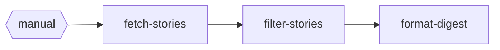

# Tentacular

Tentacular is a secure workflow build and execution system for AI agents. Instead of long-lived monolithic automation stacks or generic node catalogs, you build purpose-fit TypeScript DAG workflows for each job, then iterate or replace them quickly.

It runs those workflows on Kubernetes with defense-in-depth sandboxing: distroless runtime images, Deno permission locking, hardened pod security context, secrets as mounted files (not env vars), and optional gVisor kernel isolation.

A Go CLI manages the full lifecycle while a Deno engine executes workflow DAGs inside hardened containers.

## Overview

```
                Developer Machine                          Kubernetes Cluster
           ┌──────────────────────────┐          ┌────────────────────────────────┐
           │                          │          │                                │
           │  tntc CLI (Go)           │          │   ┌────────────────────────┐   │
           │  ┌────────────────────┐  │  deploy  │   │  Pod (gVisor sandbox)  │   │
           │  │ init / validate    │  │ ───────> │   │  ┌──────────────────┐  │   │
           │  │ dev / test         │  │ (config  │   │  │ Deno Engine (TS) │  │   │
           │  │ build / deploy     │  │  +code)  │   │  │ ┌──────────────┐ │  │   │
           │  │ status / cluster   │  │  status  │   │  │ │ Workflow DAG │ │  │   │
           │  │ visualize          │  │ <─────── │   │  │ └──────────────┘ │  │   │
           │  └────────────────────┘  │          │   │  └──────────────────┘  │   │
           │           │              │          │   │  /app/workflow (CM)    │   │
           │      ┌────┴────┐         │          │   │  /app/secrets (vol)    │   │
           │      │ Docker  │         │  push    │   └────────────────────────┘   │
           │      │ Build   │ ────────│────────> │   ConfigMap (code) ──┘         │
           │      └─────────┘         │  (image) │   K8s Secret                   │
           │                          │          │   Zot Registry                 │
           └──────────────────────────┘          └────────────────────────────────┘
```

## Features

- **DAG-based workflows** — define multi-step pipelines as TypeScript functions connected by edges
- **Five-layer security** — distroless containers, Deno permission locking, gVisor kernel isolation, K8s SecurityContext, secrets-as-volumes
- **Local development** — hot-reload dev server with `tntc dev`
- **Fixture-based testing** — test individual nodes or full pipelines against JSON fixtures
- **One-command deploy** — build, push, and deploy to Kubernetes with automatic secret provisioning
- **No kubectl required** — full operational lifecycle (deploy, status, run, logs, undeploy) through the CLI

## Prerequisites

- [Go](https://go.dev/dl/) 1.22+ — build the CLI
- [Deno](https://deno.land/) 2.x — execute workflow engine locally, run tests
- [Docker](https://docs.docker.com/get-docker/) 20+ — build container images
- [kubectl](https://kubernetes.io/docs/tasks/tools/) 1.28+ — Kubernetes cluster access
- A Kubernetes cluster 1.28+ as deployment target
- **Optional:** [gVisor](https://gvisor.dev/) on cluster nodes for kernel-level sandboxing (see [docs/gvisor-setup.md](docs/gvisor-setup.md))

## Installation

```bash
git clone git@github.com:randybias/tentacular.git
cd tentacular
go build -o tntc ./cmd/tntc/
./tntc --help
```

## Quick Start

### 1. Scaffold a new workflow

```bash
tntc init my-workflow
```

### 2. Validate and test locally

```bash
tntc validate my-workflow
tntc test my-workflow
```

### 3. Run the dev server

```bash
tntc dev
# POST http://localhost:8080/run to trigger, GET /health to check
```

### 4. Build and deploy

```bash
tntc build my-workflow -r registry.example.com --push
tntc deploy my-workflow -n my-namespace -r registry.example.com
```

### 5. Operate

```bash
tntc status my-workflow -n my-namespace
tntc run my-workflow -n my-namespace
tntc logs my-workflow -n my-namespace
tntc undeploy my-workflow -n my-namespace
```

## Node Contract

Every node is a TypeScript file with a single default export:

```typescript
import type { Context } from "tentacular";

export default async function run(ctx: Context, input: unknown): Promise<unknown> {
  const resp = await ctx.fetch("github", "/user/repos");
  ctx.log.info("Fetched repos");
  return { repos: await resp.json() };
}
```

See [docs/node-contract.md](docs/node-contract.md) for the full Context API, auth injection, and testing fixtures.

## Examples

| Example | Description | Secrets Required |
|---------|-------------|-----------------|
| `hn-digest` | Fetch and filter top Hacker News stories | None |
| `github-digest` | Fetch GitHub repos and create a summary digest | GitHub token, Slack webhook |
| `pr-digest` | Summarize PRs with Claude and send to Slack | GitHub token, Anthropic API key, Slack webhook |
| `uptime-prober` | Probe HTTP endpoints on cron, alert to Slack when down | Slack webhook |
| `cluster-health-collector` | Fetch K8s cluster state, store to Postgres | Postgres password |
| `cluster-health-reporter` | Daily AI-analyzed cluster health report to Slack | Postgres password, Anthropic API key, Slack webhook |
| `word-counter` | Simple word counting example | None |

```bash
# Try the no-secrets example
tntc validate example-workflows/hn-digest
tntc test example-workflows/hn-digest
tntc dev example-workflows/hn-digest
```

**hn-digest** DAG:



## Architecture

| Directory | Purpose |
|-----------|---------|
| `cmd/tntc/` | CLI entry point |
| `pkg/` | Go packages: spec parser, builder, K8s client, CLI commands |
| `engine/` | Deno TypeScript engine: compiler, executor, context, server |
| `example-workflows/` | Runnable example workflows |
| `deploy/` | Infrastructure scripts (gVisor installation, RuntimeClass) |
| `docs/` | Reference documentation |

### Security Model

Five layers of defense-in-depth, from innermost to outermost:

1. **Distroless base image** — no shell, no package manager, minimal attack surface
2. **Deno permission locking** — `--allow-net`, `--allow-read=/app`, `--allow-write=/tmp` only
3. **gVisor sandbox** — kernel-level syscall interception via `runtimeClassName: gvisor`
4. **K8s SecurityContext** — `runAsNonRoot`, `readOnlyRootFilesystem`, `drop: ALL` capabilities
5. **Secrets as volumes** — never environment variables, mounted read-only at `/app/secrets`

**Execution Model:** All nodes in a workflow execute within a single Deno process and share memory. Stages run sequentially while nodes within each stage run concurrently via async/await. Isolation is provided at the pod level through gVisor's syscall interception, Deno's permission controls, and Kubernetes SecurityContext hardening. This single-process design prioritizes simplicity and performance while maintaining strong container-level security boundaries.

### Why Not Monolithic?

| | Monolithic Engines | Tentacular |
|--|-------------------|-------------|
| **Isolation** | One breach = all processes | Each workflow pod isolated by gVisor |
| **Scaling** | All or nothing | Per-workflow autoscaling |
| **Deployment** | Redeploy everything | Update code via ConfigMap, no rebuild |
| **Security** | Single trust boundary | Five-layer defense-in-depth |

See [docs/architecture.md](docs/architecture.md) for the full architecture reference including data flow, execution model, and extension points.

## Documentation

| Document | Content |
|----------|---------|
| [Architecture](docs/architecture.md) | System design, data flow, execution model, extension points |
| [CLI Reference](docs/cli.md) | Commands, flags, and usage examples |
| [Workflow Spec](docs/workflow-spec.md) | workflow.yaml format and field reference |
| [Node Contract](docs/node-contract.md) | Context API, auth injection, testing fixtures |
| [Secrets](docs/secrets.md) | Local and production secrets management |
| [Testing](docs/testing.md) | Go, Deno, and workflow test commands |
| [gVisor Setup](docs/gvisor-setup.md) | gVisor installation and verification |
| [Roadmap](docs/roadmap.md) | Project roadmap and future plans |

## License

Proprietary. Copyright Mirantis, Inc. All rights reserved. See LICENSE.
