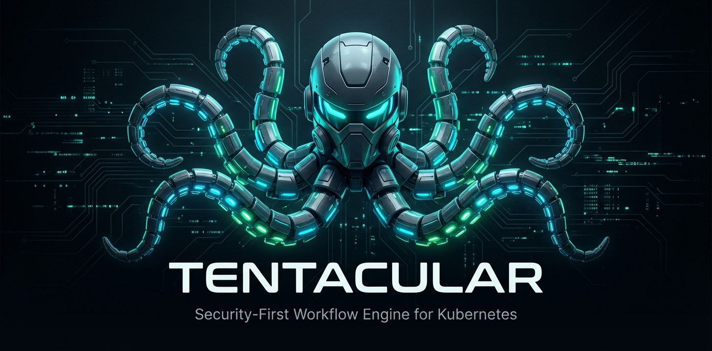

<p align="center">
  
</p>

# Tentacular

Tentacular is a secure workflow build and execution system for AI agents. Instead of long-lived monolithic automation stacks or generic node catalogs, you build purpose-fit TypeScript DAG workflows for each job, then iterate or replace them quickly.

It runs those workflows on Kubernetes with defense-in-depth sandboxing: distroless runtime images, Deno permission locking, hardened pod security context, secrets as mounted files (not env vars), and optional gVisor kernel isolation.

Three components form the system: a Go CLI manages the full lifecycle, an in-cluster MCP server proxies all cluster operations through scoped RBAC, and a Deno engine executes workflow DAGs inside hardened containers.

## Ecosystem

| Repository | Purpose |
|------------|---------|
| [tentacular](https://github.com/randybias/tentacular) | Go CLI (`tntc`) + Deno workflow engine |
| [tentacular-mcp](https://github.com/randybias/tentacular-mcp) | In-cluster MCP server (Helm chart, 32 tools) |
| [tentacular-skill](https://github.com/randybias/tentacular-skill) | Agent skill definition for AI assistants |
| [tentacular-scaffolds](https://github.com/randybias/tentacular-scaffolds) | [Scaffold quickstart library](https://randybias.github.io/tentacular-scaffolds) |
| [tentacular-docs](https://github.com/randybias/tentacular-docs) | [Documentation site](https://randybias.github.io/tentacular-docs) |

## Documentation

Full documentation is available at **[randybias.github.io/tentacular-docs](https://randybias.github.io/tentacular-docs)** — including [quickstart](https://randybias.github.io/tentacular-docs/guides/quickstart/), [architecture](https://randybias.github.io/tentacular-docs/concepts/architecture/), [CLI reference](https://randybias.github.io/tentacular-docs/reference/cli/), [security model](https://randybias.github.io/tentacular-docs/concepts/security/), and [cookbook](https://randybias.github.io/tentacular-docs/cookbook/deploy-tentacle/).

## Overview


All CLI commands that interact with the cluster route through the MCP server via HTTP. The MCP server is installed separately using its Helm chart (`helm install tentacular-mcp`).

## Features

- **DAG-based workflows** — define multi-step pipelines as TypeScript functions connected by edges
- **Five-layer security** — distroless containers, Deno permission locking, gVisor kernel isolation, K8s SecurityContext, secrets-as-volumes
- **Local development** — hot-reload dev server with `tntc dev`
- **Fixture-based testing** — test individual nodes or full pipelines against JSON fixtures
- **One-command deploy** — build, push, and deploy to Kubernetes with automatic secret provisioning
- **No kubectl required** — full operational lifecycle (deploy, status, run, logs, undeploy) through the CLI via in-cluster MCP server
- **Runtime telemetry** — in-memory event tracking with `GET /health?detail=1` for execution telemetry snapshots, used by MCP health tools for G/A/R classification

## Prerequisites

- [Deno](https://deno.land/) 2.x — execute workflow engine locally, run tests
- [Docker](https://docs.docker.com/get-docker/) 20+ — build container images
- [kubectl](https://kubernetes.io/docs/tasks/tools/) 1.28+ — Kubernetes cluster access
- A Kubernetes cluster 1.28+ as deployment target
- [Go](https://go.dev/dl/) 1.22+ — only if building the CLI from source
- **Optional:** [gVisor](https://gvisor.dev/) on cluster nodes for kernel-level sandboxing (see [gVisor Setup guide](https://randybias.github.io/tentacular-docs/guides/gvisor-setup/))

## Installation

### Recommended

```bash
curl -fsSL https://raw.githubusercontent.com/randybias/tentacular/main/install.sh | sh
```

This installs the `tntc` binary and the Deno engine to `~/.local/bin` and `~/.tentacular/engine`.

### Build from Source

```bash
git clone git@github.com:randybias/tentacular.git
cd tentacular
make install        # builds with version info and installs to ~/.local/bin/
tntc version        # verify
```

> **Note:** `make build-cli` (or `make install`) embeds version, commit, and build date via
> ldflags. A bare `go build ./cmd/tntc` produces a dev build with `version=dev`.

## Quick Start

### 1. Scaffold a new workflow

```bash
tntc init my-workflow
```

### 2. Validate and test locally

```bash
tntc validate my-workflow
tntc test my-workflow
```

### 3. Run the dev server

```bash
tntc dev
# POST http://localhost:8080/run to trigger, GET /health to check
```

### 4. Install the MCP server (one-time per cluster)

```bash
# Clone the MCP server repo
git clone git@github.com:randybias/tentacular-mcp.git

# Generate a token and install via Helm
TOKEN=$(openssl rand -hex 32)
kubectl create namespace tentacular-support
helm install tentacular-mcp ./tentacular-mcp/charts/tentacular-mcp \
  --namespace tentacular-system --create-namespace \
  --set auth.token="${TOKEN}"
```

See the [MCP Server Setup guide](https://randybias.github.io/tentacular-docs/guides/mcp-server-setup/) for Helm values and configuration options.

### 5. Configure the CLI

```bash
tntc configure --registry registry.example.com
# Add MCP endpoint and token to ~/.tentacular/config.yaml
```

See the [Cluster Configuration guide](https://randybias.github.io/tentacular-docs/guides/cluster-configuration/) for the full config reference.

### 6. Build and deploy

```bash
tntc build my-workflow -r registry.example.com --push
tntc deploy my-workflow -n my-namespace -r registry.example.com
```

### 7. Operate

```bash
tntc status my-workflow -n my-namespace
tntc run my-workflow -n my-namespace
tntc logs my-workflow -n my-namespace
tntc undeploy my-workflow -n my-namespace
```

## Node Contract

Every node is a TypeScript file with a single default export:

```typescript
import type { Context } from "tentacular";

export default async function run(ctx: Context, input: unknown): Promise<unknown> {
  const gh = ctx.dependency("github-api");
  const resp = await gh.fetch!("/user/repos", {
    headers: { "Authorization": `Bearer ${gh.secret}` },
  });
  ctx.log.info("Fetched repos");
  return { repos: await resp.json() };
}
```

See [Node Contract reference](https://randybias.github.io/tentacular-docs/reference/node-contract/) for the full Context API, auth patterns, and testing fixtures.

## Scaffold Library

Production-ready scaffold quickstarts are available in [tentacular-scaffolds](https://github.com/randybias/tentacular-scaffolds) ([browse online](https://randybias.github.io/tentacular-scaffolds)):

```bash
# Browse available scaffolds
tntc scaffold list
tntc scaffold search monitoring
tntc scaffold info hn-digest

# Scaffold from a quickstart
tntc scaffold init hn-digest my-news-digest
cd my-news-digest
tntc validate
tntc dev
```

| Scaffold | Description | Complexity |
|----------|-------------|-----------|
| `word-counter` | Simple word counting example | simple |
| `hn-digest` | Fetch and filter top Hacker News stories | moderate |
| `uptime-prober` | Probe HTTP endpoints on cron, alert to Slack | moderate |
| `github-digest` | Fetch GitHub repos and create a summary digest | moderate |
| `pr-review` | Automated PR review with parallel security scans | advanced |
| `cluster-health-collector` | Collect K8s cluster health, store to Postgres | moderate |

See `tntc scaffold list` for the full library or [Catalog Usage guide](https://randybias.github.io/tentacular-docs/guides/catalog-usage/).

## Architecture

| Directory | Purpose |
|-----------|---------|
| `cmd/tntc/` | CLI entry point |
| `pkg/` | Go packages: spec parser, builder, MCP client, CLI commands |
| `engine/` | Deno TypeScript engine: compiler, executor, context, server, telemetry |
| `pkg/catalog/` | Catalog client for fetching scaffold quickstarts |
| `deploy/` | Infrastructure scripts (gVisor installation, RuntimeClass) |

### Namespace Model

| Namespace | Purpose | Protection |
|-----------|---------|------------|
| `tentacular-system` | MCP server, control plane, cron scheduler | Protected from deletion by self-guard |
| `tentacular-support` | esm.sh module proxy, caches jsr/npm modules | Protected from deletion by self-guard |
| `tentacular-exoskeleton` | Backing services (Postgres, NATS, RustFS) when exoskeleton is enabled | Protected from deletion by self-guard |
| Workflow namespaces | One per deployment, `managed-by: tentacular` label | Created/deleted via MCP tools |

Workflow pods run in their own namespaces with default-deny NetworkPolicy and contract-derived egress rules. They never run inside `tentacular-system`.

### Infrastructure Setup


Infrastructure is created in three stages:

1. **Helm install** creates the `tentacular-system` namespace with the MCP server Deployment, ServiceAccount, ClusterRole/Binding, auth Secret, and Service. The `tentacular-support` namespace must be pre-created (`kubectl create namespace tentacular-support`).

2. **MCP server startup** triggers the proxy reconciler, which auto-creates the esm.sh Deployment and Service inside `tentacular-support`. The reconciler re-checks every 5 minutes.

3. **`tntc deploy`** (on-demand) calls `ns_create` to create a workflow namespace with default-deny NetworkPolicy, DNS-allow policy, ResourceQuota, LimitRange, and workflow ServiceAccount/Role/RoleBinding. Then `wf_apply` adds the workflow-specific ConfigMap, Deployment, Service, Secret, and contract-derived NetworkPolicy.

### Security Model

Five layers of defense-in-depth, from innermost to outermost:

1. **Distroless base image** — no shell, no package manager, minimal attack surface
2. **Deno permission locking** — `--allow-net`, `--allow-read=/app`, `--allow-write=/tmp` only
3. **gVisor sandbox** — kernel-level syscall interception via `runtimeClassName: gvisor`
4. **K8s SecurityContext** — `runAsNonRoot`, `readOnlyRootFilesystem`, `drop: ALL` capabilities
5. **Secrets as volumes** — never environment variables, mounted read-only at `/app/secrets`

**Execution Model:** All nodes in a workflow execute within a single Deno process and share memory. Stages run sequentially while nodes within each stage run concurrently via async/await. Isolation is provided at the pod level through gVisor's syscall interception, Deno's permission controls, and Kubernetes SecurityContext hardening. This single-process design prioritizes simplicity and performance while maintaining strong container-level security boundaries.

See [Architecture](https://randybias.github.io/tentacular-docs/concepts/architecture/) for the full architecture reference including data flow, execution model, and extension points.

## License

Proprietary. Copyright Mirantis, Inc. All rights reserved. See LICENSE.
