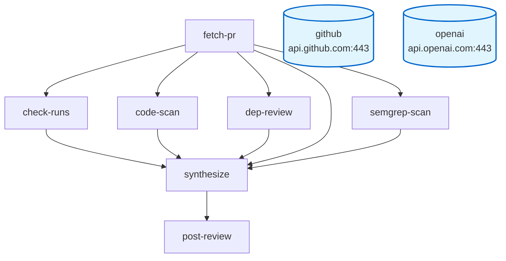

```mermaid
graph TD
    check-runs[check-runs]
    code-scan[code-scan]
    dep-review[dep-review]
    fetch-pr[fetch-pr]
    post-review[post-review]
    semgrep-scan[semgrep-scan]
    synthesize[synthesize]
    check-runs --> synthesize
    code-scan --> synthesize
    dep-review --> synthesize
    fetch-pr --> check-runs
    fetch-pr --> code-scan
    fetch-pr --> dep-review
    fetch-pr --> semgrep-scan
    fetch-pr --> synthesize
    semgrep-scan --> synthesize
    synthesize --> post-review

    %% External Dependencies
    dep_github[(github<br/>api.github.com:443)]
    style dep_github fill:#e1f5ff,stroke:#0066cc,stroke-width:2px
    dep_openai[(openai<br/>api.openai.com:443)]
    style dep_openai fill:#e1f5ff,stroke:#0066cc,stroke-width:2px
```
