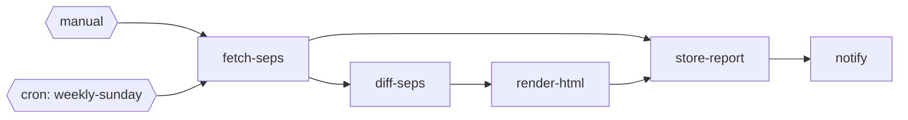

# SEP Tracker

Track MCP Specification Enhancement Proposals (SEPs) from GitHub PRs, detect changes over time, generate HTML reports, store results to Postgres, and notify Slack.

## DAG



## Nodes

| Node | Description | External Dependencies |
|------|-------------|-----------------------|
| `fetch-seps` | Fetches open PRs from GitHub, filters by SEP label, extracts SEP ID from title | GitHub API |
| `diff-seps` | Queries previous snapshot from Postgres, compares to detect added/removed/updated SEPs | Postgres |
| `render-html` | Pure transform: generates HTML report with color-coded change rows | None |
| `store-report` | Fan-in node: stores snapshot and HTML report to Postgres tables | Postgres |
| `notify` | Sends Slack notification with report summary; graceful no-op without webhook | Slack webhook |

## Configuration

From `workflow.yaml` `config:` block, available via `ctx.config`:

| Key | Description | Default |
|-----|-------------|---------|
| `target_repo` | GitHub repository to track | `modelcontextprotocol/specification` |
| `sep_label` | PR label to filter by | `sep` |
| `pg_host` | Postgres host | `172.27.18.1` |
| `pg_port` | Postgres port | `30432` |
| `pg_database` | Postgres database name | `appdb` |
| `pg_user` | Postgres user | `postgres` |
| `timeout` | Per-node timeout | `120s` |
| `retries` | Retry count on failure | `1` |

## Secrets

Copy `.secrets.yaml.example` to `.secrets.yaml` and fill in values:

| Service | Key | Description |
|---------|-----|-------------|
| `github` | `token` | GitHub personal access token (for higher rate limits) |
| `postgres` | `password` | Postgres password |
| `slack` | `webhook_url` | Slack incoming webhook URL (optional -- notification skipped if missing) |

## Postgres Tables

The `store-report` node auto-creates these tables:

- **`sep_snapshots`** -- timestamped snapshots of all SEPs with JSONB storage
- **`sep_reports`** -- HTML reports linked to snapshots

## Setup

```bash
# Validate workflow
tntc validate example-workflows/sep-tracker

# Run fixture tests
tntc test example-workflows/sep-tracker

# Local dev server
tntc dev example-workflows/sep-tracker

# Trigger manually
curl -X POST http://localhost:8080/run
```

## Triggers

- **Manual**: `POST /run` via CLI or curl
- **Cron**: `weekly-sunday` runs every Sunday at 20:00 UTC
